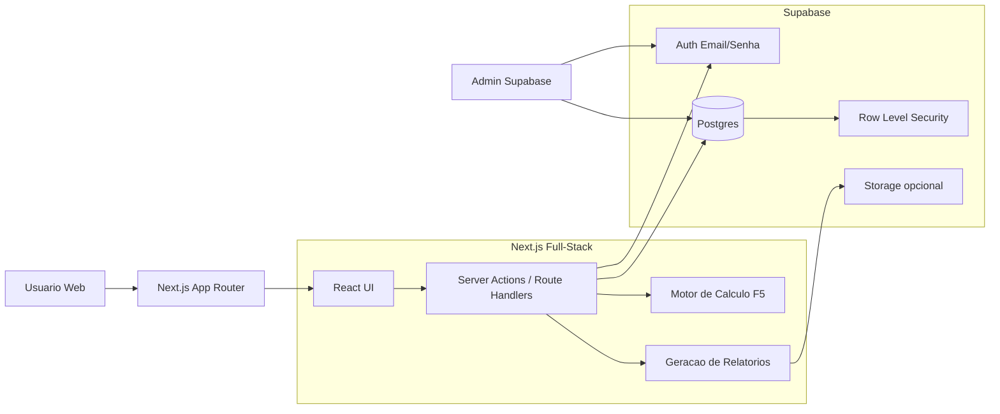
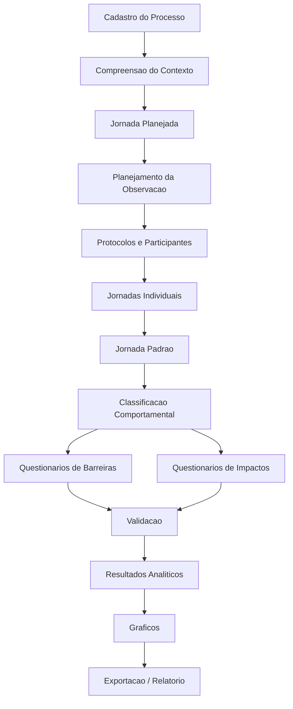
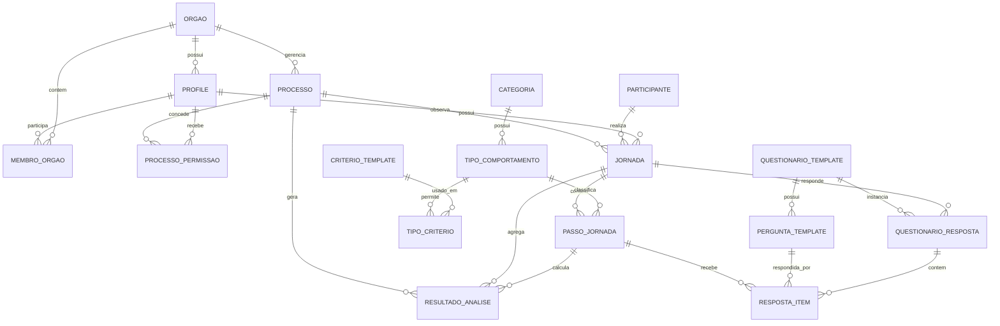
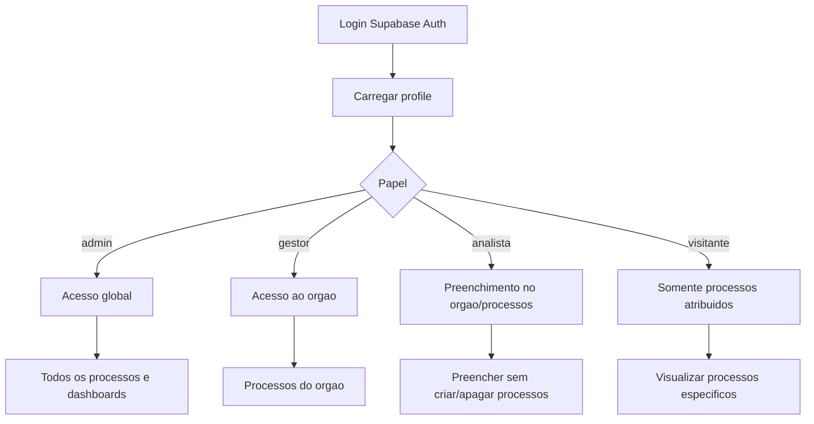
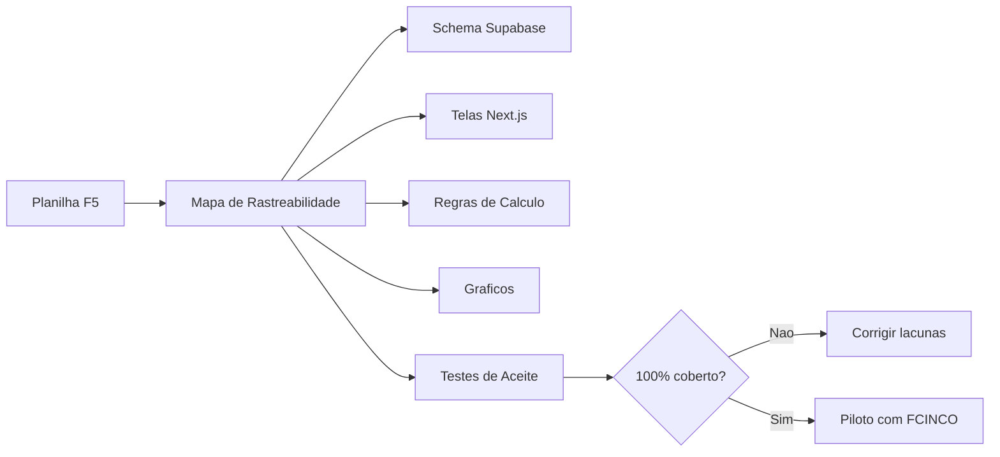

# Auditoria de Produto e Técnica - Anti-Sludge Gov

Data: 2026-05-09

## 1. Resumo Executivo

O projeto Anti-Sludge Gov ainda não deve ser tratado como uma implementação fiel da planilha F5 nem da metodologia Anti-Sludge. A base atual evoluiu para um monorepo moderno com FastAPI, Next.js, PostgreSQL e extensão de navegador, mas o produto implementado cobre apenas parte do fluxo: cadastro de processos, etapas, captura bruta de navegação pela extensão, dashboard heurístico e alguns endpoints de análise.

A lacuna principal é conceitual e estrutural: a planilha e a metodologia trabalham com jornada planejada, jornadas individuais, jornada padrão, questionários, respostas por critério, observações, validação e gráficos consolidados. O app atual modela `processo`, `etapa`, `jornada_observada`, `tempo_etapa`, avaliações e resultados, mas não oferece o fluxo completo para a equipe FCINCO responder os questionários, registrar observações manuais por usuário, montar jornadas individuais/padrão e gerar os gráficos metodológicos da planilha.

O MVP atual é uma boa base tecnológica, mas precisa de uma correção de rumo: priorizar o modelo metodológico F5 antes de adicionar inteligência automática. A extensão pode continuar existindo, mas como apoio opcional de evidência, não como substituta das respostas e observações da equipe pesquisadora.

## 2. Fontes Analisadas

Fontes locais usadas nesta auditoria:

- `OQ SABEMOS.MD`: briefing principal e anotações de Wendel/Janaina.
- `F5 - Mapeamento Anti-Sludge_02.04 (1).xlsx`: planilha original F5.
- `estensao wendel/F5-Mapeamento-Anti-Sludge`: modelo conceitual, modelo físico, SQLs, protótipo Flask e handoff.
- `AntiSludge`: repositório Streamlit usado como referência metodológica.
- `anti-sludge-gov`: implementação atual em monorepo.
- `anti-sludge-gov/docs`: DRS, proposta de extensão, docs do vault e anotações.

## 3. Entendimento do Produto

### 3.1 Objetivo do Sistema

O Anti-Sludge Gov deve digitalizar a aplicação da metodologia F5 Anti-Sludge da CINCO/MGI para diagnosticar e mensurar barreiras em serviços públicos digitais. O objetivo não é apenas cadastrar etapas de um serviço, mas permitir que uma equipe pesquisadora:

- compreenda o contexto do serviço;
- mapeie a jornada planejada;
- observe jornadas individuais de usuários;
- registre manualmente comportamentos, tempos, desvios e observações;
- responda questionários de barreiras e impactos;
- consolide uma jornada padrão;
- gere resultados e gráficos para priorização de sludges.

### 3.2 Atores Principais

- Equipe FCINCO/pesquisadora: conduz observações, responde questionários, lança evidências, analisa resultados.
- Coordenadores/supervisores: acompanham processos, validam metodologia, consultam gráficos e relatórios.
- Administradores técnicos: gerenciam acesso, catálogo metodológico, banco e operação.
- Usuários observados: participantes das jornadas individuais. Não necessariamente acessam o sistema, mas precisam ser representados no banco com cuidado de privacidade.

### 3.3 Metodologia F5 - Fluxo Operacional

Pela planilha e pelo app Streamlit de referência, o fluxo metodológico é composto por etapas encadeadas:

1. Compreensão do contexto: coleta de informações gerais, usuários, jornada planejada, tempos, indicadores e hipóteses/dificuldades.
2. Mapeamento comportamental: definição de jornada planejada, coleta de jornadas individuais e construção de jornada padrão.
3. Classificação comportamental: categorização dos comportamentos por categoria/tipo e critérios aplicáveis.
4. Dimensionamento de barreiras: respostas de critérios de barreira em escala 1 a 5, com opção "não se aplica" e observação discursiva.
5. Dimensionamento de impactos: critérios de impacto, incluindo Necessidade, Carga Cognitiva, Emoção e Consequência. Necessidade é especial: deve ser avaliada uma vez por jornada, não por etapa.
6. Validação, resultados e gráficos: consolidação das avaliações, tempos, diferenças entre jornada planejada/padrão/individual e visualizações finais.

### 3.4 Jornadas Que o Sistema Precisa Suportar

A planilha deixa claro que existem pelo menos três conceitos distintos:

- Jornada planejada: caminho formal previsto pela equipe do serviço ou manual.
- Jornada individual: caminho observado para uma pessoa usuária específica.
- Jornada padrão: síntese normalizada das jornadas individuais, usada para dimensionamento e análise.

O app atual usa `etapa` como se ela fosse a jornada planejada e `jornada_observada` como uma sessão genérica, mas ainda não modela bem a jornada individual como sequência própria de passos, desvios, repetições e observações manuais.

### 3.5 Questionários

As anotações de Wendel/Janaina dizem explicitamente:

- falta associar questionários;
- os gráficos devem partir das respostas dos questionários;
- a equipe FCINCO responderá 6 questionários para jornada planejada e jornadas individuais;
- observações de usuário serão lançadas manualmente pela equipe FCINCO.

Conclusão de produto: o sistema precisa tratar questionário como entidade de domínio, não como formulário solto na UI. Deve existir versionamento de perguntas, instância de resposta, respondente, tipo de jornada e vínculo com processo/jornada/etapa.

## 4. Estado Atual da Implementação

### 4.1 Arquitetura Atual

O repositório `anti-sludge-gov` está organizado como monorepo:

- `apps/api`: FastAPI, SQLAlchemy, Alembic, PostgreSQL.
- `apps/web`: Next.js, React, Tailwind/shadcn, Recharts.
- `apps/extension`: extensão Plasmo/WebExtension.
- `docs`: documentação, ADRs e materiais de requisito.

Essa separação é adequada como base. O problema está menos na stack e mais nos contratos de domínio incompletos e em inconsistências entre documentação, banco, API e UI.

### 4.2 Backend

O backend contém módulos por features: `processes`, `catalog`, `analysis`, `observations`, `extension_sessions`, `dashboard`, `auth`, `rbac`.

O que existe:

- CRUD de processos e etapas.
- Catálogo de categorias, tipos e critérios.
- Critérios de barreira e impacto por etapa.
- Avaliações de barreira e impacto no banco/modelo.
- Jornadas observadas simples e tempos por etapa.
- Resultado de análise com índice de sludge.
- Extensão capturando páginas, cliques e interações.
- Dashboard e cálculo heurístico.

O que não está suficientemente implementado:

- participante/pessoa usuária observada;
- jornada individual como sequência de passos;
- jornada padrão;
- questionários e respostas rastreáveis;
- observações manuais estruturadas por etapa, usuário e evidência;
- entrevista pós-observação;
- avaliação de Necessidade como entidade própria;
- gráficos equivalentes aos da planilha;
- workflow completo da equipe FCINCO.

### 4.3 Frontend

Rotas atuais principais:

- `/login`
- `/`
- `/processos`
- `/processos/[id]`
- `/admin/rbac`

Telas atuais:

- dashboard geral;
- listagem de processos;
- detalhe do processo com abas de contexto, análise de sludge e capturas;
- modal de processo;
- modal de etapa;
- tela RBAC.

Não existem telas completas para:

- cadastro/acompanhamento de participantes;
- planejamento de observação;
- protocolo de observação;
- lançamento manual de jornada individual;
- questionários por jornada;
- respostas de barreira e impacto;
- observações discursivas por resposta;
- validação e construção da jornada padrão;
- visualização dos gráficos finais da planilha.

### 4.4 Extensão

A extensão captura:

- sessão;
- páginas visitadas;
- duração;
- cliques;
- posição do mouse;
- metadados básicos do elemento clicado;
- scroll como flag.

Ela envia esses dados para `/sessoes-extensao` usando `X-API-KEY`.

Limites atuais:

- não há identificação robusta por participante/device no modelo atual, apesar do ADR mencionar Device ID;
- a captura não substitui observação manual;
- o vínculo de intervalos da extensão com etapas existe no backend e em componente frontend isolado, mas não está integrado ao fluxo visível;
- o botão "Visualizar Timeline" em capturas não abre uma timeline real;
- a extensão não resolve a necessidade central de questionários.

## 5. Banco de Dados

### 5.1 Modelo Planejado por Wendel

O modelo planejado inclui entidades importantes:

- `orgao`
- `usuario`
- `usuario_processo_permissao`
- `log_auditoria`
- `processo`
- `etapa`
- `observador`
- `participante`
- `jornada_observada`
- `passo_observado`
- `entrevista_pos_observacao`
- `criterio_barreira`
- `criterio_impacto`
- `avaliacao_barreira`
- `avaliacao_impacto`
- `avaliacao_necessidade` no SQL da pasta Wendel
- `resultado_analise`

Esse desenho é mais aderente ao domínio de pesquisa do que o modelo atual, especialmente por separar participante, passo observado e necessidade.

### 5.2 Modelo Atual do App

O banco atual possui:

- catálogo: `categoria`, `tipo_comportamento`, `criterio_template`, `grupo_analise`, `tipo_criterio`, `escala_avaliacao`, `glossario`;
- processo: `processo`, `etapa`;
- observação: `observador`, `jornada_observada`, `tempo_etapa`;
- análise: `criterio_barreira`, `criterio_impacto`, `avaliacao_barreira`, `avaliacao_impacto`, `resultado_analise`;
- extensão: `sessao_extensao`, `pagina_extensao`, `interacao_extensao`;
- acesso: `rbac_emails`.

### 5.3 Normalização

Pontos positivos:

- catálogo metodológico separado de processos;
- relação muitos-para-muitos `tipo_criterio`;
- avaliações separadas de critérios;
- extensão normalizada em sessão, página e interação;
- resultados agregados separados das respostas.

Problemas:

- `jornada_observada` não possui `participante_id`, então não representa adequadamente a pessoa usuária observada.
- `observador` recebeu campos como `estado` e `escolaridade`, que parecem pertencer mais ao participante ou ao perfil sociodemográfico.
- `tempo_etapa` é insuficiente para jornada individual, pois só permite uma linha por `jornada_observada_id + etapa_id`. Isso impede repetição, desvios, passos extras e ordem real.
- não existe `passo_observado`, embora ele esteja no modelo conceitual planejado.
- não existe `entrevista_pos_observacao`.
- não existe `avaliacao_necessidade` no app atual, apesar de aparecer no SQL de Wendel e na metodologia.
- não existe estrutura genérica de questionários, perguntas, versões e respostas.
- `processo.jornada_planejada_descricao` guarda texto livre, mas a jornada planejada real precisa ser uma sequência estruturada de etapas.
- `resultado_analise` materializa cálculo, mas não registra a versão/metodologia/fonte das respostas usadas.

### 5.4 Aderência ao Banco Planejado

O app atual aderiu parcialmente ao banco planejado, mas removeu ou simplificou entidades críticas:

- removeu `orgao` e `usuario` completos, substituindo por `rbac_emails`;
- removeu `participante`;
- substituiu `passo_observado` por `tempo_etapa`, perdendo ordem real e desvios;
- removeu `entrevista_pos_observacao`;
- não incorporou `avaliacao_necessidade`;
- não criou tabelas de questionário.

### 5.5 Dados Iniciais e Catálogo

Há um risco grave: `02_initial_data.sql` cadastra grupos, categorias, tipos, critérios e glossário, mas não popula `tipo_criterio` nem `escala_avaliacao` com as perguntas/escala da planilha. Isso compromete a funcionalidade de "critérios permitidos por tipo" e a geração correta dos questionários.

A planilha contém a fonte real para:

- critérios por tipo;
- perguntas por critério;
- textos das notas 1 e 5;
- critérios de impacto;
- gráficos e tabelas dinâmicas.

Esses dados precisam virar seed/migração rastreável, não depender de preenchimento manual.

## 6. Inconsistências Técnicas

### 6.1 Arquitetura Documentada vs Código

`apps/api/ARCHITECTURE.MD` diz que:

- rotas não devem importar `models`;
- regras de negócio devem passar por use cases;
- repositories encapsulam persistência.

Na prática:

- routers importam modelos SQLAlchemy diretamente;
- vários endpoints usam `CRUDBase` genérico;
- `dashboard/router.py` consulta ORM diretamente;
- há lógica de cálculo e escrita em `GET /dashboard/process/{id}`;
- `analysis_use_cases.py` importa modelos diretamente e usa heurística de demo.

Isso não impede o app de funcionar, mas quebra a arquitetura prometida e aumenta o risco de regras duplicadas.

### 6.2 Endpoints Incompletos ou Desalinhados

Exemplos:

- frontend chama `GET /observations/jornadas/{id}`, mas backend não possui esse endpoint.
- `GET /observations/jornadas?processo_id=...` é usado pelo frontend, mas backend ignora `processo_id`.
- componentes `AddCriterionModal`, `ExtensionLinkerModal` e `JourneyDifferentialModal` existem, mas não estão integrados às páginas.
- análise de sludge é recalculada por um GET de dashboard, gerando efeito colateral em consulta.
- vários endpoints de mutação de etapas, observações e análise não exigem autenticação/role de forma consistente.

### 6.3 Heurística Mascarando Ausência de Dados

O cálculo atual usa heurísticas quando não há avaliação manual:

- barreira baseada em palavras como "anexar", "espera", "preencher";
- impacto baseado em tempo/obrigatoriedade;
- gráfico sempre preenchido para parecer funcional.

Isso é útil para demo, mas é perigoso para o produto real. A metodologia exige que gráficos venham das respostas dos questionários e observações. Heurística deve ser claramente marcada como estimativa, não misturada com resultado metodológico.

### 6.4 Scripts e Seeds

Há scripts quebrados ou perigosos:

- `scripts/seed_f5_data.py` importa caminhos antigos (`app.models.process_model`, `app.models.analysis_model`) que não existem na estrutura atual.
- `seed_db.py` cria dados aleatórios e escalas genéricas, que não representam a planilha F5.
- `02_initial_data.sql` não carrega toda a matriz metodológica.
- documentação menciona `f5_mapeamento_antisludge.sql`, mas a pasta `database` tem SQL dividido e migrations Alembic, criando duas fontes de verdade.

## 7. UI/UX

### 7.1 Pontos Positivos

- O app tem aparência moderna.
- Há navegação básica por dashboard, processos e detalhes.
- O formulário de contexto já cobre parte da etapa "Compreensão do Contexto".
- O cadastro de etapa usa categoria e tipo de comportamento.
- A captura da extensão aparece em uma aba específica.

### 7.2 Problemas de Produto

O design atual comunica "dashboard analítico em tempo real", mas a necessidade imediata é "ferramenta metodológica de pesquisa". A UI deveria guiar a equipe FCINCO pelo fluxo F5, não apenas mostrar cards e ranking.

Faltam telas de trabalho:

- wizard de aplicação F5 por processo;
- checklist de completude por etapa metodológica;
- tela de jornada planejada estruturada;
- tela de planejamento/protocolo de observação;
- tela de participante;
- tela de jornada individual por usuário;
- editor de passos observados com ordem, tempo, desvio, repetição e observação;
- questionários de barreiras e impactos;
- validação e construção da jornada padrão;
- gráficos finais com fontes e filtros.

### 7.3 Problemas Visuais

- Uso excessivo de cards arredondados grandes para ferramenta operacional.
- Linguagem visual mais próxima de marketing/dashboard do que de instrumento de pesquisa.
- Textos como "Live Analysis" e "Monitoramento em Tempo Real" sugerem automação que o sistema ainda não sustenta metodologicamente.
- Falta densidade e clareza para lançamento repetitivo de dados.
- Algumas ações parecem existir, mas não fazem fluxo completo, como "Visualizar Timeline".

### 7.4 Experiência Recomendada

A UI deve mudar para uma experiência orientada a tarefas:

- visão do processo com status por etapa F5;
- abas ou wizard: Contexto, Jornada Planejada, Observações, Jornadas Individuais, Jornada Padrão, Questionários, Resultados;
- tabelas editáveis e formulários densos;
- botões claros para "lançar observação", "responder questionário", "comparar jornada", "gerar gráficos";
- indicadores de pendência: perguntas não respondidas, etapas sem critérios, jornadas sem observação, gráficos sem dados reais.

## 8. Requisitos Funcionais Recompondo o Escopo

### RF-01 - Gestão de Processos/Serviços

Cadastrar processo, objetivo, esfera, abrangência, público-alvo, perfil foco, indicadores, hipóteses e registros de reclamação/satisfação.

Status atual: parcial.

### RF-02 - Jornada Planejada Estruturada

Cadastrar etapas planejadas com ordem, comportamento, categoria, tipo, obrigatoriedade, repetição e tempo planejado.

Status atual: parcial. Existe `etapa`, mas sem workflow robusto nem validação metodológica completa.

### RF-03 - Planejamento de Observação

Registrar protocolo de observação, tarefa, observadores, participante, data, consentimento/LGPD e escopo.

Status atual: ausente.

### RF-04 - Participantes

Cadastrar participante anonimizado com perfil/dados sociodemográficos necessários.

Status atual: ausente.

### RF-05 - Jornada Individual

Registrar a sequência real de passos observados por usuário, incluindo ordem real, etapa planejada correspondente, desvios, passos extras, repetições, duração, horário e observações.

Status atual: crítico. `tempo_etapa` não resolve.

### RF-06 - Observações Manuais

Permitir lançamento manual de observações pela equipe FCINCO por jornada, passo, etapa e resposta.

Status atual: parcial em campos soltos, sem workflow.

### RF-07 - Questionários F5

Criar e responder seis questionários/metainstrumentos por jornada planejada e por jornada individual, vinculando perguntas, respostas, escala, "não se aplica" e campo discursivo.

Status atual: ausente.

### RF-08 - Critérios de Barreiras por Tipo

Aplicar somente os critérios permitidos para cada tipo de comportamento, conforme planilha `#CritériosPorTipo` e `#Conceitos&Escalas`.

Status atual: modelo existe, seed não carrega dados completos.

### RF-09 - Impactos

Avaliar Carga Cognitiva, Emoção e Consequência por etapa, e Necessidade uma vez por jornada.

Status atual: parcial. Necessidade ausente como entidade própria.

### RF-10 - Jornada Padrão

Construir jornada padrão a partir das jornadas individuais, com critérios de convergência/divergência e duração média.

Status atual: ausente.

### RF-11 - Gráficos da Planilha

Gerar gráficos equivalentes a:

- média de barreiras por critério/categoria/comportamento;
- média de impactos;
- comparação barreiras x impactos;
- tempo absoluto;
- tempo escalonado;
- diferença de tempo;
- ranking de sludge por etapa.

Status atual: parcial e heurístico.

### RF-12 - Extensão como Evidência

Capturar navegação e permitir vincular trechos da sessão a passos/etapas observadas.

Status atual: parcial, sem fluxo integrado.

### RF-13 - Relatório/Exportação

Gerar relatório metodológico com contexto, jornadas, respostas, gráficos e recomendações.

Status atual: ausente.

## 9. Requisitos Não Funcionais

- Rastreabilidade: toda resposta deve saber sua pergunta, versão, respondente, data e fonte.
- Privacidade/LGPD: participante deve ser anonimizado; dados sensíveis da navegação e textos clicados precisam de política clara.
- Auditabilidade: alterações em processos, respostas e resultados devem ser registradas.
- Segurança: endpoints de mutação devem exigir autenticação e papel adequado.
- Reprodutibilidade: cálculos devem ser reproduzíveis a partir de respostas reais, sem heurística silenciosa.
- Acessibilidade: interface deve ser usável por equipe técnica e não técnica, com contraste, labels claros e navegação previsível.
- Evolutividade: catálogo F5 deve ser seedado e versionado.

## 10. Problemas Priorizados

### Críticos

1. Ausência de questionários e respostas como domínio.
2. Ausência de participante e jornada individual real.
3. `tempo_etapa` impede desvios, repetições e passos extras.
4. Necessidade não modelada como avaliação única por jornada.
5. Gráficos atuais não derivam obrigatoriamente das respostas da metodologia.
6. Seeds não carregam `tipo_criterio`/`escala_avaliacao` conforme planilha.
7. Arquitetura documentada não bate com o código.
8. Autorização inconsistente em endpoints.

### Importantes

1. Falta jornada padrão.
2. Falta protocolo de observação e entrevista pós-observação.
3. Componentes frontend existem sem integração.
4. Extensão captura dados, mas não gera fluxo de análise completo.
5. Scripts de seed quebrados ou com dados aleatórios.
6. Documentação do produto está fragmentada e contraditória.

### Melhorias Futuras

1. Auditoria automatizada por grafo/NLP, conforme DRS do TCC.
2. Exportação PDF/CSV.
3. Painel de calibragem de pesos.
4. Relatórios comparativos entre serviços.
5. Recursos avançados de timeline da extensão.
6. Integração com gov.br/SSO institucional.

## 11. Roadmap Recomendado

### Fase 0 - Alinhamento e Fonte da Verdade

Objetivo: parar a divergência entre planilha, docs e app.

Entregas:

- definir a planilha F5 como fonte metodológica primária do MVP;
- documentar que o DRS de navegação autônoma/grafo é visão futura ou linha paralela;
- criar um mapa oficial: aba da planilha -> entidade -> endpoint -> tela;
- revisar `ANALISE_FUNCIONAL_F5.md`, pois ele declara concluídas funcionalidades que ainda não estão prontas do ponto de vista do usuário.

### Fase 1 - Banco Metodológico

Objetivo: corrigir a base de dados antes de mexer em telas.

Entregas:

- criar `participante`;
- criar `passo_observado`;
- criar `avaliacao_necessidade`;
- criar `questionario_template`, `pergunta_template`, `questionario_resposta`, `resposta_item`;
- criar suporte a `tipo_jornada`: planejada, individual, padrão;
- popular `tipo_criterio` e `escala_avaliacao` a partir da planilha;
- revisar Alembic como fonte única de evolução.

### Fase 2 - Workflow FCINCO

Objetivo: permitir uso real pela equipe pesquisadora.

Entregas:

- tela de contexto completa;
- tela de jornada planejada estruturada;
- tela de participantes e protocolos;
- tela de lançamento manual de jornada individual;
- tela de questionários por jornada;
- campos "não se aplica" e discursivo nas respostas;
- status de completude por processo.

### Fase 3 - Cálculo e Gráficos Reais

Objetivo: substituir heurística como fonte principal.

Entregas:

- motor de cálculo baseado em respostas reais;
- regra clara para Necessidade;
- gráficos equivalentes à planilha;
- filtros por processo, jornada, participante, etapa e critério;
- marcação visual de dados reais vs estimados.

### Fase 4 - Integração da Extensão

Objetivo: usar captura como evidência complementar.

Entregas:

- timeline de sessão;
- vínculo de intervalo com passo observado;
- revisão de privacidade dos textos capturados;
- identificação anônima de device/participante;
- comparação entre tempo capturado e tempo lançado manualmente.

### Fase 5 - Hardening

Objetivo: preparar para piloto.

Entregas:

- segurança por papel em todos os endpoints;
- logs de auditoria;
- testes de domínio e integração;
- documentação operacional;
- exportação de relatório;
- validação com Janaina/Wendel em cenário real.

## 12. Recomendação de Arquitetura

Manter o monorepo, mas reorganizar o backend em torno do domínio real:

- `catalog`: catálogo F5 versionado.
- `processes`: serviço/processo e contexto.
- `journeys`: planejada, individual, padrão, passos.
- `questionnaires`: templates, perguntas, respostas.
- `observations`: protocolos, participantes, observações manuais.
- `analysis`: cálculo, agregações e resultados.
- `extension_sessions`: captura e evidência digital.
- `reporting`: gráficos e exportações.
- `auth/rbac`: acesso.

Regra importante: dashboards e gráficos devem consultar resultados calculados ou views/read models, não disparar cálculo com efeito colateral em GET.

## 13. Revisão de Stack e Escopo Técnico

### 13.1 Decisão de Escopo: Extensão Fora do MVP Metodológico

Para o próximo ciclo, a extensão do navegador deve sair do escopo ativo. Isso não significa apagar o código, mas congelar qualquer evolução relacionada a `apps/extension`, `extension_sessions`, timeline de cliques e vínculo automático com etapas.

Motivo: a necessidade mais urgente é garantir 100% das funcionalidades da planilha F5 em fluxo web. A extensão pode ser útil no futuro como evidência complementar, mas neste momento ela aumenta a complexidade e desvia a equipe do núcleo metodológico: jornadas, questionários, respostas, observações manuais, validação e gráficos.

Recomendação prática:

- manter o código da extensão no repositório, mas marcar como fora do escopo do MVP;
- não usar extensão como dependência de cálculo;
- não desenhar telas novas dependendo de sessão capturada;
- remover do roadmap imediato qualquer entrega vinculada à extensão;
- retomar a extensão somente depois que a planilha estiver 100% coberta.

### 13.2 A Stack Atual Faz Sentido?

A stack atual, com Next.js no frontend, FastAPI no backend, PostgreSQL e extensão, é tecnicamente defensável para um produto que tenha:

- automação de navegação;
- análise NLP;
- cálculo assíncrono pesado;
- crawler/grafo;
- integração com pipelines Python;
- extensão como parte central da coleta.

Mas para o escopo atual, que é digitalizar fielmente a planilha F5 e permitir preenchimento/gestão por níveis de acesso, essa stack está mais complexa do que precisa. O sistema hoje tem contratos demais para pouco domínio consolidado: frontend Next.js, API FastAPI, banco PostgreSQL, Alembic, extensão, auth própria/RBAC, seeds SQL e scripts Python.

Conclusão: a stack atual pode ser reaproveitada em partes, mas não é a melhor forma de recomeçar corretamente se a prioridade for velocidade, clareza e aderência total à planilha.

### 13.3 Next.js Full-Stack + Supabase

Para o MVP metodológico, faz sentido migrar para uma arquitetura mais simples:

- Next.js App Router como aplicação full-stack;
- Supabase Auth para login com usuário/senha;
- Supabase Postgres como banco principal;
- Supabase Row Level Security para autorização por órgão/processo;
- Server Actions ou Route Handlers do Next.js para regras de escrita, relatórios e cálculos;
- componentes e telas reaproveitados do `anti-sludge-gov` quando fizerem sentido;
- novo schema de banco desenhado a partir da planilha, não do app atual.

Essa abordagem reduz a sensação de "duas APIs" e concentra o produto em um único app web. O browser não deve falar livremente com todas as tabelas; operações sensíveis devem passar por Server Actions/Route Handlers no Next, usando Supabase de forma segura.

Supabase continua viável para o projeto porque oferece autenticação, Postgres, políticas por linha e SDKs. A documentação oficial do Supabase confirma suporte a email/senha, criação administrativa de usuários e RLS. Usuários com email fictício podem ser criados via painel/Admin API para ambientes controlados, desde que a equipe entenda a limitação: recuperação de senha, confirmação por email e convites reais não funcionam bem se o email não existir. Para piloto real, o ideal é usar emails reais ou institucionais.

### 13.4 O Que Reaproveitar do Anti-Sludge Gov

Reaproveitar:

- identidade visual geral, com ajustes para interface mais operacional;
- componentes de tabela, modal, layout, sidebar e autenticação visual;
- parte da tela de processos;
- parte do formulário de contexto;
- conceitos de catálogo F5;
- ideias de dashboards, desde que os dados venham de respostas reais;
- documentação/ADRs úteis, depois de corrigidos.

Não reaproveitar sem revisão:

- schema atual como fonte final;
- cálculo heurístico como regra metodológica;
- endpoints FastAPI como contrato definitivo;
- seeds aleatórios/genéricos;
- `tempo_etapa` como substituto de jornada individual;
- telas que prometem análise "live" sem dado real.

Reescrever:

- banco metodológico;
- fluxo de jornadas;
- questionários;
- RBAC por órgão/processo;
- motor de cálculo baseado na planilha;
- gráficos finais.

### 13.5 Recomendação Final de Stack

Recomendação para o MVP F5:

**Next.js full-stack + Supabase Auth + Supabase Postgres + RLS.**

Manter FastAPI apenas se uma destas condições for verdadeira:

- a equipe decidir priorizar crawler/NLP/grafo ainda neste ciclo;
- houver cálculo Python complexo que não compense portar para TypeScript/Postgres;
- existir dependência institucional de API Python separada.

Como a extensão saiu do escopo e a meta é cobrir 100% da planilha, a opção full-stack em Next.js é mais coerente.

## 14. Controle de Acesso

### 14.1 Níveis Informados por Janaina

A conversa com Janaina define quatro níveis:

- `admin`: acesso a tudo, todos os processos, extração de dados, dashboards completos de vários usuários.
- `gestor`: acesso a tudo do órgão, define usuários analistas, cria/apaga processos e preenche informações.
- `analista`: preenche informações, mas não cria nem apaga processos.
- `visitante`: visualiza somente processos específicos atribuídos pelo admin.

Observação importante: a mensagem "visitante pode visualizar todas as abas/informações do admin" foi corrigida na sequência para "processos específicos". A regra final deve ser: visitante visualiza todas as abas permitidas, mas apenas dos processos atribuídos.

### 14.2 Modelo de Autorização Recomendado

O controle de acesso deve ter duas camadas:

1. Papel global do usuário: admin, gestor, analista, visitante.
2. Escopo de acesso: todos os processos, órgão específico ou processos específicos.

Entidades recomendadas:

- `profile`: vinculado ao `auth.users` do Supabase.
- `orgao`: órgão público.
- `membro_orgao`: associação usuário-orgão-papel.
- `processo_permissao`: acesso específico de visitantes a processos.

### 14.3 Matriz de Permissões

| Ação | Admin | Gestor | Analista | Visitante |
|---|---:|---:|---:|---:|
| Ver todos os órgãos/processos | Sim | Não | Não | Não |
| Ver processos do próprio órgão | Sim | Sim | Sim | Não |
| Ver processos atribuídos | Sim | Sim | Sim | Sim |
| Criar processo | Sim | Sim, no órgão | Não | Não |
| Apagar processo | Sim | Sim, no órgão | Não | Não |
| Editar contexto | Sim | Sim | Sim | Não |
| Editar jornadas/questionários | Sim | Sim | Sim | Não |
| Gerenciar usuários | Sim | Gestor gerencia analistas do órgão | Não | Não |
| Exportar dados | Sim | Sim, do órgão | Não por padrão | Não |
| Ver dashboards completos | Sim | Sim, do órgão | Sim, do órgão/processo | Sim, apenas atribuídos |

## 15. Garantia de 100% das Funcionalidades da Planilha

### 15.1 Critério de Aceite

O MVP só deve ser considerado correto quando todas as abas funcionais da planilha F5 tiverem equivalente no sistema web.

Isso deve ser tratado como requisito formal:

> Nenhuma funcionalidade da planilha F5 pode ficar sem mapeamento explícito para tela, entidade, regra de negócio, cálculo ou relatório.

### 15.2 Mapa de Cobertura Obrigatório

Criar e manter uma tabela de rastreabilidade com:

- aba da planilha;
- objetivo metodológico;
- campos/colunas usados;
- entidade do banco;
- tela;
- endpoint/server action;
- regra de cálculo;
- gráfico/saída;
- status: não iniciado, parcial, completo, validado por Janaina/Wendel.

### 15.3 Abas Funcionais a Cobrir

Cobertura mínima obrigatória:

- `1 Compreensão do Contexto`;
- `2 Mapeamento Comportamental`;
- `2.1 Mapeamento JorPlanejada`;
- `2.2 Mapeamento JorPadrão`;
- `3 Classificação Comportamental`;
- `4.1 Dimensionamento Barreiras`;
- `4.2 Dimensionamento Impactos`;
- `5 Validação`;
- `6 Resultados Analise`;
- `6 Resultados Graficos`;
- `JU.Planejamento`;
- `JU.Protocolo 01..05`;
- `JU.Individual 01..05`;
- `JP. Cpto.Ord.Dur.Clas`;
- `JP. Resultados`;
- `# Tabela JorPadrão`;
- `#TabDinDim`;
- `#Glossário`;
- `#Conceitos&Escalas`;
- `#Listas`;
- `#CritériosPorTipo`.

### 15.4 Funcionalidades Que Não Podem Faltar

- cadastro completo do contexto;
- jornada planejada estruturada;
- planejamento de observação;
- protocolo por usuário;
- jornada individual por usuário;
- construção da jornada padrão;
- classificação de comportamentos;
- critérios por tipo de comportamento;
- perguntas de barreiras diferentes por critério/tipo;
- respostas 1 a 5;
- opção "não se aplica";
- campo discursivo por resposta;
- avaliação de Necessidade uma vez por jornada;
- avaliação de Carga Cognitiva, Emoção e Consequência;
- cálculo de médias por comportamento, critério, categoria e jornada;
- cálculo de tempo absoluto, tempo escalonado e diferença de tempo;
- gráficos equivalentes aos da planilha;
- exportação de dados.

## 16. Diagramas Mermaid

### 16.1 Arquitetura Alvo do MVP

### 16.2 Fluxo Metodológico F5 no Sistema

### 16.3 Modelo de Dados Conceitual Alvo

### 16.4 RBAC e Escopo de Acesso

### 16.5 Relação Planilha -> Sistema

## 17. Conclusão

O Anti-Sludge Gov tem uma base tecnológica aproveitável, mas o núcleo metodológico ainda está incompleto. O maior risco é continuar evoluindo dashboard, extensão e heurística enquanto faltam as entidades que permitem aplicar a metodologia F5 de verdade.

A prioridade deve ser reconstruir o domínio em torno de jornadas, questionários, respostas, observações e gráficos rastreáveis. Para o MVP metodológico, a recomendação é simplificar a stack para Next.js full-stack com Supabase, congelar a extensão e usar a planilha como contrato de aceite: 100% das funcionalidades devem ter equivalente rastreável no sistema.
