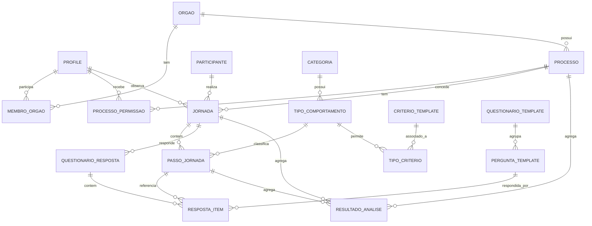

# 02 — Modelo de Domínio F5

Este documento define as entidades do banco. Cada migration em
`supabase/migrations/` materializa uma fatia deste modelo.

## Visão de alto nível

## Entidades

### Acesso

#### `orgao`
Órgão público (ente federativo). Escopo principal de RBAC.

- `id` (uuid, pk)
- `nome` (text, unique)
- `sigla` (text, unique)
- `esfera` (enum: federal, estadual, municipal)
- `created_at`, `updated_at`

#### `profile`
Perfil de usuário, vinculado a `auth.users` do Supabase.

- `id` (uuid, pk, fk → `auth.users.id`)
- `nome_completo` (text)
- `papel_global` (enum: admin, gestor, analista, visitante)
- `created_at`, `updated_at`

#### `membro_orgao`
Associação usuário-órgão. Um usuário pode pertencer a vários órgãos com
papéis diferentes.

- `id` (uuid, pk)
- `profile_id` (uuid, fk)
- `orgao_id` (uuid, fk)
- `papel_no_orgao` (enum: gestor, analista)
- `unique(profile_id, orgao_id)`

#### `processo_permissao`
Permite atribuir processos específicos a usuários (uso típico: visitante).

- `id` (uuid, pk)
- `profile_id` (uuid, fk)
- `processo_id` (uuid, fk)
- `pode_editar` (boolean, default false)
- `unique(profile_id, processo_id)`

### Catálogo F5 (versionado, fonte: planilha)

#### `categoria`
Categoria comportamental (#Conceitos&Escalas).
- `id`, `codigo` (unique), `nome`, `descricao`, `ordem`

#### `tipo_comportamento`
Tipo dentro de uma categoria.
- `id`, `categoria_id`, `codigo`, `nome`, `descricao`, `ordem`

#### `criterio_template`
Critério (de barreira ou impacto) com perguntas e textos das notas.
- `id`, `codigo` (unique), `nome`, `dimensao` (enum: barreira, impacto)
- `subdimensao` (enum: necessidade, carga_cognitiva, emocao, consequencia, null para barreira)
- `pergunta_padrao` (text)
- `texto_nota_1` (text), `texto_nota_5` (text)
- `escala_min` (default 1), `escala_max` (default 5)
- `permite_nao_se_aplica` (boolean, default true)

#### `tipo_criterio`
Quais critérios se aplicam a quais tipos de comportamento.
- `tipo_comportamento_id`, `criterio_template_id`
- `pk(tipo_comportamento_id, criterio_template_id)`

#### `escala_avaliacao`
Texto explicativo de cada nota por critério (planilha #Conceitos&Escalas).
- `criterio_template_id`, `nota` (1..5), `descricao`
- `pk(criterio_template_id, nota)`

#### `glossario`
Termos da planilha (#Glossário).
- `termo`, `definicao`, `aba_origem`

### Processo e contexto

#### `processo`
Serviço público sob análise.
- `id`, `orgao_id`, `nome`, `objetivo`, `abrangencia`, `publico_alvo`,
  `perfil_foco`, `indicadores_satisfacao`, `hipoteses`, `created_by`,
  `created_at`, `updated_at`, `arquivado` (bool)

### Jornadas

#### `jornada`
Genérica para os três tipos. `tipo_jornada` discrimina.
- `id`, `processo_id`, `tipo_jornada` (enum: planejada, individual, padrao)
- `participante_id` (nullable, só preenche em individual)
- `observador_id` (nullable, só preenche em individual; fk profile)
- `data_observacao` (nullable)
- `protocolo_id` (nullable, fk → protocolo_observacao)
- `notas` (text)
- `unique(processo_id, tipo_jornada, participante_id)` para garantir
  uma planejada / uma padrão / uma individual por participante

#### `passo_jornada`
Sequência real de passos. Substitui o antigo `tempo_etapa`, permitindo
ordem real, desvios, repetições, passos extras.
- `id`, `jornada_id`, `ordem` (int, sequencial dentro da jornada)
- `etapa_planejada_id` (nullable, fk para passo da jornada planejada)
- `tipo_comportamento_id` (fk catálogo)
- `descricao` (text)
- `obrigatorio` (bool)
- `tempo_segundos` (int, nullable)
- `eh_desvio` (bool, default false)
- `eh_repeticao` (bool, default false)
- `notas` (text)

### Observação

#### `participante`
Pessoa observada, anonimizada.
- `id`, `processo_id`, `codigo` (unique no processo, ex: P01, P02)
- `idade_faixa`, `escolaridade`, `regiao`, `genero`, `outras_caracteristicas` (jsonb)
- `consentimento_lgpd` (bool), `data_consentimento`
- `created_at`

#### `protocolo_observacao`
Protocolo aplicado a um participante (planejamento da observação).
- `id`, `processo_id`, `participante_id`, `observador_id` (fk profile)
- `tarefa`, `data_observacao`, `local`, `dispositivos`
- `consentimento_obtido` (bool), `notas_pre`, `notas_pos`

#### `entrevista_pos_observacao`
Entrevista após observação.
- `id`, `protocolo_id`, `respostas` (jsonb), `observador_id`, `data`

### Questionários

#### `questionario_template`
Versão do questionário (cada vez que a metodologia mudar, nova versão).
- `id`, `codigo` (ex: Q_BARREIRAS_PLANEJADA), `versao` (int)
- `nome`, `descricao`, `aplicavel_a` (enum: jornada_planejada, jornada_individual, ambas)
- `dimensao` (enum: barreira, impacto, necessidade, contexto)

#### `pergunta_template`
Pergunta dentro de um questionário, derivada do critério.
- `id`, `questionario_template_id`, `criterio_template_id` (nullable)
- `texto`, `ordem`, `tipo_resposta` (enum: escala_1_5, texto, sim_nao, multipla)
- `permite_nao_se_aplica` (bool)
- `permite_observacao` (bool, default true)

#### `questionario_resposta`
Instância de resposta para uma jornada específica.
- `id`, `questionario_template_id`, `jornada_id`
- `respondente_id` (fk profile)
- `data_resposta`, `concluido` (bool)

#### `resposta_item`
Resposta a uma pergunta dentro de uma instância.
- `id`, `questionario_resposta_id`, `pergunta_template_id`
- `passo_jornada_id` (nullable, quando a pergunta é por passo)
- `nota` (int 1-5, nullable)
- `nao_se_aplica` (bool, default false)
- `observacao_discursiva` (text)
- `created_at`, `updated_at`

### Avaliações materializadas (derivadas das respostas)

São views ou tabelas materializadas para acelerar gráficos. Reproduzíveis
a partir de `resposta_item`.

#### `avaliacao_barreira`
- jornada, passo, criterio, nota, na, observacao

#### `avaliacao_impacto`
- jornada, passo, criterio, subdimensao, nota, na, observacao

#### `avaliacao_necessidade`
- jornada, criterio, nota, na, observacao
  (uma vez por jornada, não por passo — regra metodológica)

### Resultados

#### `resultado_analise`
Resultado calculado a partir das respostas. Recalculado por Server Action
explícita.
- `id`, `processo_id`, `jornada_id` (nullable, agregação por jornada),
- `passo_jornada_id` (nullable, por passo)
- `tipo_metrica` (enum: barreira_media, impacto_medio, sludge_index, tempo_total, tempo_diferenca)
- `valor` (numeric)
- `metadados` (jsonb)
- `calculado_em`, `versao_metodologia`

### Auditoria

#### `log_auditoria`
- `id`, `actor_id`, `acao`, `entidade`, `entidade_id`, `dados_antes`, `dados_depois`, `criado_em`
