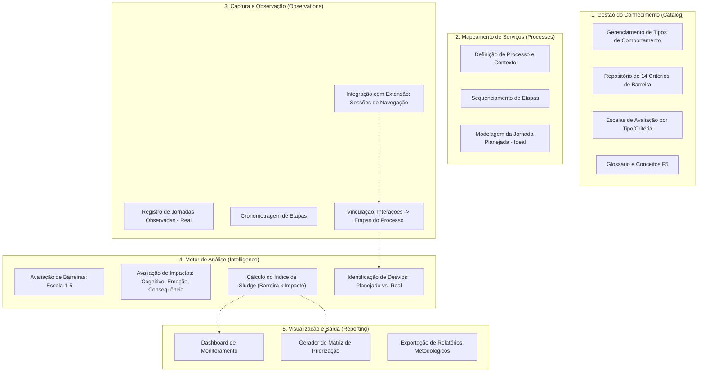

# Análise de Funcionalidades: Excel F5 vs. Backend

Este documento mapeia as funcionalidades da Metodologia F5 (extraídas do arquivo `F5 - Mapeamento Anti-Sludge_02.04.xlsx`) em relação ao estado atual do Backend, identificando o que é necessário para evoluir de um sistema CRUD para uma ferramenta de análise de Sludge completa.

## 🏗️ Diagrama de Funcionalidades Planejadas

## 🔍 Lacunas Identificadas (Gaps)

Após análise do Excel de referência, as seguintes funcionalidades críticas foram mapeadas e estão em desenvolvimento:

### 1. ✅ O Motor de Cálculo (The Sludge Engine) - CONCLUÍDO
Implementado em `app/domain/sludge_logic.py` e `app/use_cases/analysis_use_cases.py`.
- **Status:** Disponível via endpoint `POST /analysis_results/calculate/{processo_id}`.

### 2. ✅ Visualização de Sludge por Etapa - CONCLUÍDO
Dados estruturados para gráficos de linha/barra (coordenadas Etapa x Índice).
- **Status:** Disponível via endpoint `GET /dashboard/process/{processo_id}`.

### 3. ✅ Regras de Negócio de Domínio (Business Rules) - CONCLUÍDO
O Excel vincula tipos específicos de comportamento a critérios específicos.
- **Status:** Backend agora valida a compatibilidade comportamento x critério no endpoint de criação e oferece sugestões filtradas via `GET /analysis_results/allowed-criteria/{etapa_id}`.

### 4. ✅ Diferencial Planejado vs. Real - CONCLUÍDO
Identificar onde o usuário "se perde" ou faz caminhos extras comparando com o ideal planejado.
- **Status:** Implementado via endpoint `GET /observations/jornadas/{id}/differential`. O motor calcula desvios de tempo por etapa, identifica etapas omitidas e gera um Índice de Eficiência Global da jornada.

### 5. Inteligência de Dados da Extensão
Vincular logs da extensão Chrome a etapas do backend.
- **Pendente:** Ferramenta para associar "Chunks" de sessões a etapas do processo.

## 🚀 Próximos Passos (Workflow de Implementação)

1.  **Integração Frontend**: Consumir o endpoint `/dashboard/process/{id}` para renderizar o gráfico de coordenadas.
2.  **Mapeamento de Critérios**: Desenvolver a validação de tipos de comportamento vs critérios permitidos.
3.  **Comparativo de Eficiência**: Implementar cálculo de métricas entre jornada real e planejada.

---
*Documento gerado automaticamente pela análise do mapeamento metodológico F5.*
