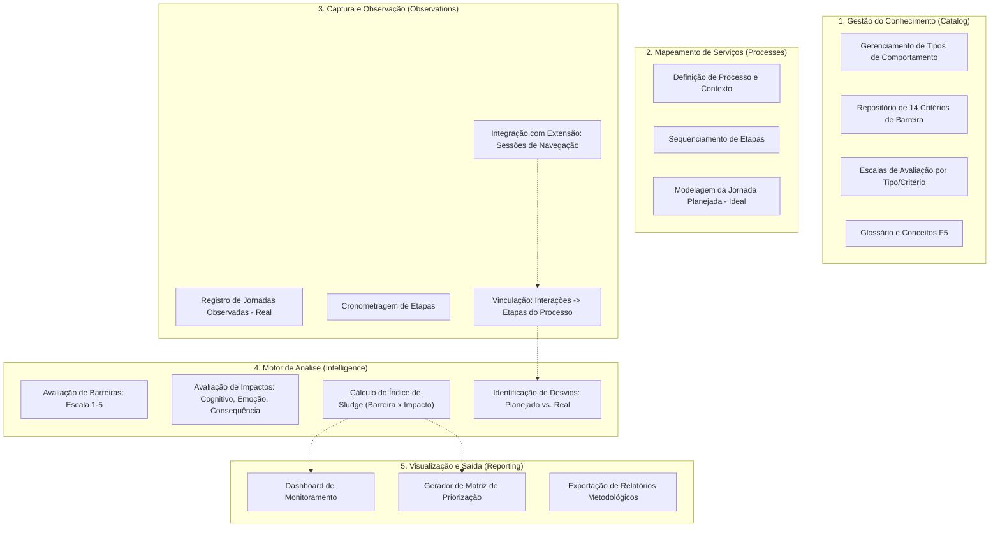

# Análise de Funcionalidades: Excel F5 vs. Backend

Este documento mapeia as funcionalidades da Metodologia F5 (extraídas do arquivo `F5 - Mapeamento Anti-Sludge_02.04.xlsx`) em relação ao estado atual do Backend, identificando o que é necessário para evoluir de um sistema CRUD para uma ferramenta de análise de Sludge completa.

## 🏗️ Diagrama de Funcionalidades Planejadas

## 🔍 Lacunas Identificadas (Gaps)

Após análise do Excel de referência, as seguintes funcionalidades críticas precisam ser implementadas no backend:

### 1. O Motor de Cálculo (The Sludge Engine)
Atualmente, as tabelas de banco de dados existem (`avaliacao_barreira`, `avaliacao_impacto`), mas o backend não "sabe" como processar esses dados segundo a Metodologia F5.
- **Necessário:** Implementar `use_cases` que realizem as agregações e cálculos de média ponderada/simples para gerar o Índice de Sludge final por etapa e por processo.

### 2. Regras de Negócio de Domínio (Business Rules)
O Excel vincula tipos específicos de comportamento (ex: "Preencher formulário") a critérios específicos (ex: "Carga Cognitiva").
- **Necessário:** Validar na API se a avaliação que está sendo submetida faz sentido para o tipo de comportamento daquela etapa, evitando dados inconsistentes (Aba `#CritériosPorTipo`).

### 3. Diferencial Planejado vs. Real
A metodologia foca em identificar onde o usuário "se perde" ou faz caminhos extras.
- **Necessário:** Lógica para comparar a `jornada_planejada` com a `jornada_observada`, gerando métricas de eficiência (cliques extras, tempo excedente).

### 4. Inteligência de Dados da Extensão
O backend já recebe logs da extensão Chrome, mas eles precisam de contexto.
- **Necessário:** Ferramenta para associar "Chunks" (pedaços) de uma sessão da extensão a uma "Etapa" do backend, permitindo que o sistema calcule o tempo real de cada etapa automaticamente.

## 🚀 Próximos Passos (Workflow de Implementação)

1.  **Criação do `SludgeCalculatorService`**: Implementar a lógica de cálculo puro em `app/domain` e orquestrá-la em `app/use_cases`.
2.  **Dashboard Endpoints**: Refatorar `app/features/dashboard` para consumir o `SludgeCalculatorService` e retornar as matrizes de priorização prontas para o frontend.
3.  **Mapeamento de Critérios**: Criar a lógica de validação que associa Tipos de Comportamento aos seus Critérios e Escalas correspondentes.

---
*Documento gerado automaticamente pela análise do mapeamento metodológico F5.*
