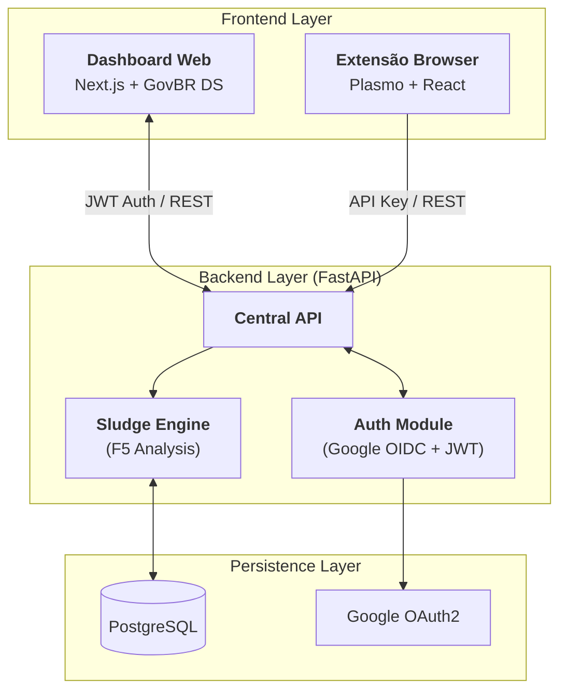
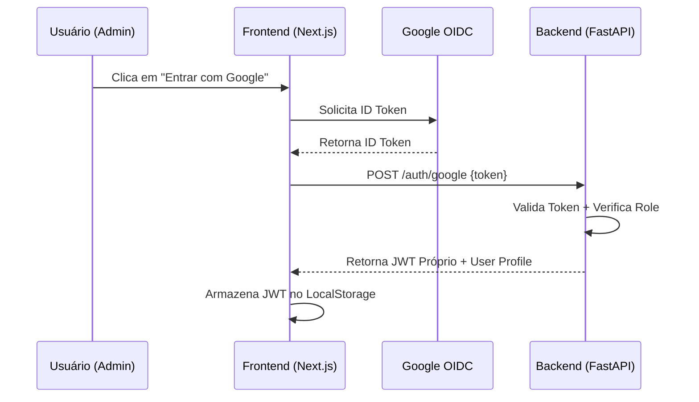
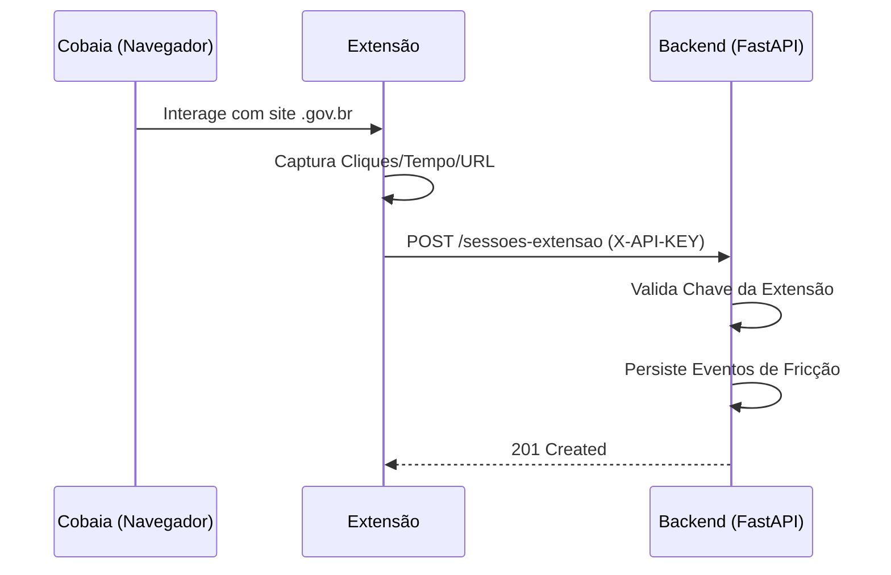

# 🏗️ Arquitetura do Sistema

Este documento descreve a organização técnica e o fluxo de dados do projeto Anti-Sludge Gov.

## 1. Visão Geral da Arquitetura

O sistema segue uma arquitetura de **Monorepo** com uma API centralizada que serve a dois clientes distintos com propósitos diferentes: coleta de dados (Extensão) e análise/gestão (Web).

---

## 2. Fluxos de Autenticação e Dados

### 2.1. Handshake de Autenticação (Dashboard)
O fluxo garante que apenas usuários autorizados (Admins/Analistas) acessem os dados consolidados.

### 2.2. Coleta de Telemetria (Extensão)
A coleta é otimizada para ser transparente e sem fricção (sem login).

---

## 3. Organização de Níveis de Acesso (RBAC)

A aplicação utiliza um sistema de filtros baseado em e-mails configurados via ambiente:

| Nível         | Identificação              | Permissões                                         |
| :------------ | :------------------------- | :------------------------------------------------- |
| **Admin**     | Lista `ADMIN_EMAILS`       | Gestão completa e acesso a todas as métricas.      |
| **Analista**  | Lista `ANALYST_EMAILS`     | Atribuição de notas de sludge e consulta.          |
| **Visitante** | Qualquer outro Google Auth | Redirecionamento automático para GitHub (Externo). |
| **Extensão**  | `X-API-KEY`                | Apenas escrita de dados de telemetria.             |
