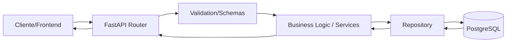
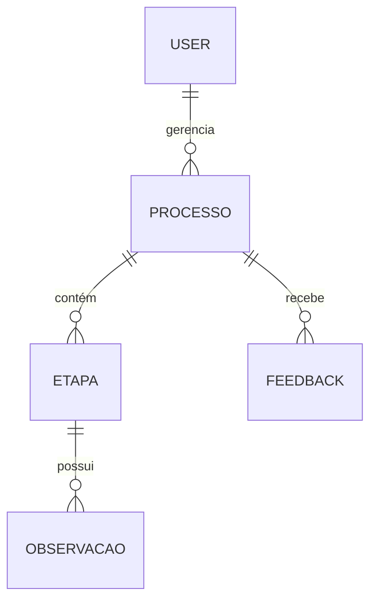

# Arquitetura do Backend

Este documento detalha a estrutura técnica, padrões de design e o fluxo de dados da API do projeto **Anti-Sludge Gov**.

## 1. Visão Geral
O backend é construído utilizando **FastAPI** (Python), seguindo uma arquitetura de **Monolito Modular** (Vertical Slices). Essa abordagem permite que cada funcionalidade (feature) seja independente, facilitando a manutenção e a escalabilidade.

### Stack Tecnológica
- **Linguagem:** Python 3.12+
- **Framework Web:** FastAPI
- **ORM:** SQLAlchemy 2.0 (com Psycopg 3)
- **Migrações:** Alembic
- **Banco de Dados:** PostgreSQL (Supabase)
- **Validação/DTOs:** Pydantic v2
- **Segurança:** JWT, RBAC e Rate Limiting (SlowAPI)

---

## 2. Padrões de Arquitetura

O projeto utiliza o padrão de **Vertical Slices** dentro do diretório `app/features/`. Cada pasta dentro de `features` contém tudo o que é necessário para aquela funcionalidade específica.

### Fluxo de uma Requisição


---

## 3. Estrutura de Diretórios

```text
apps/api/
├── app/
│   ├── api/                # Ponto de entrada global (v1/api.py)
│   ├── core/               # Configurações globais, segurança e middlewares
│   ├── features/           # Camada de fatias verticais (Modular Monolith)
│   │   ├── processes/      # Exemplo de feature
│   │   │   ├── router.py   # Endpoints da feature
│   │   │   ├── schemas.py  # DTOs (Request/Response)
│   │   │   ├── models.py   # Modelos SQLAlchemy
│   │   │   └── repository.py # Lógica de acesso ao banco
│   ├── services/           # Serviços compartilhados (ex: Discord)
│   └── main.py             # Inicialização da aplicação
├── alembic/                # Histórico de migrações do banco
└── scripts/                # Utilitários de seed e automação
```

---

## 4. Camadas Detalhadas

### API Layer (Routers)
Localizada em `app/features/*/router.py`. Responsável por definir os métodos HTTP, as rotas e a injeção de dependências (como a sessão do banco de dados). Utiliza os `schemas.py` para validar a entrada e formatar a saída.

### Domain/Business Layer
Embora o projeto utilize Repositories, a lógica de negócio costuma residir no `router.py` para operações simples ou em classes de serviço quando a complexidade aumenta.

### Data Access Layer (Repositories)
Encapsula as chamadas do SQLAlchemy. Evita que o código da API precise lidar diretamente com queries complexas, promovendo a reutilização de métodos como `get_by_id` ou `update`.

---

## 5. Segurança e Infraestrutura

### RBAC (Role-Based Access Control)
O sistema implementa controle de acesso baseado em funções. Os e-mails dos usuários são verificados contra listas de permissões configuradas no ambiente (`ADMIN_EMAILS`, `RESEARCHER_EMAILS`, etc.).

### Middlewares
1. **CORS:** Restrito às origens permitidas (Frontend Vercel/Local).
2. **Logging Middleware:** Registra o tempo de execução de cada rota e gera headers de performance (`X-Process-Time`).
3. **Rate Limiter:** Proteção contra abusos usando o `slowapi`.

### Integrações Externas
- **Supabase:** Hospedagem do banco de dados e autenticação secundária.
- **Discord:** Notificações via Webhooks para eventos críticos ou feedbacks.

---

## 6. Diagrama de Entidades (Simplificado)



> Para detalhes específicos de cada tabela, consulte o documento [[Manuais/Guia de Manutenção do Banco (Alembic)|Guia de Manutenção do Banco (Alembic)]] disponível no Vault.
